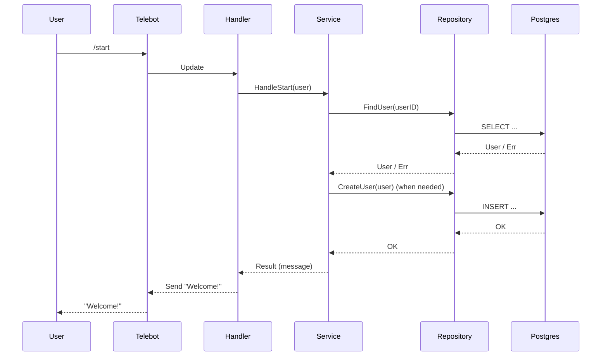

# Architecture

## Overview

Himera is a Go backend coupled with a Telegram bot. It stores persistent state in PostgreSQL, uses Redis for fast access and caching, and exposes both health checks and Prometheus metrics for monitoring. See [README.md](../README.md) for setup and local run instructions.

## Layers (Clean Architecture)

- **cmd/bot** — application entrypoint that wires configuration, logging, databases, health checks, metrics HTTP server, and the Telegram bot.
- **internal/domain** — domain entities and business rules; the core model of users, balances, trades, etc.
- **internal/service** — application services and use cases that orchestrate domain logic.
- **internal/repository** — adapters for PostgreSQL and Redis; responsible for persisting and loading data.
- **internal/handler** — transport layer (Telegram command handlers, HTTP endpoints, future gRPC).
- **internal/state** — long-running processes, finite-state machines, schedulers, background workers.
- **pkg/config**, **pkg/logger**, **pkg/redis** — infrastructure shared across the project (configuration loading, logging, Redis clients, etc.).

Dependency rule: outer layers depend on inner layers, but never the opposite. For example, handlers call services, which depend on domain abstractions; repositories implement interfaces defined within the domain/service layer, and infrastructure packages do not import application logic.

## Runtime flow

### Startup

1. `main` (from `cmd/bot`) loads configuration via Viper, combining YAML files and environment variables.
2. Initializes a structured logger (`slog`) with optional Sentry integration for error reporting.
3. Opens a PostgreSQL connection using DSN from config.
4. Connects to Redis and wraps the client with metrics instrumentation.
5. Constructs a health checker that verifies database, Redis, and Telegram bot connectivity.
6. Starts an HTTP server exposing `/metrics` (Prometheus) and `/health`.
7. Builds the Telegram bot (telebot v3), registers command handlers, and starts polling (or webhook mode).

### Request/Command flow

1. Telegram sends an update (e.g., `/start`).
2. The bot routes the update to the corresponding handler.
3. Handler executes application service logic.
4. Service interacts with repositories to load/update domain data.
5. Repository reads/writes data in PostgreSQL or Redis.
6. Service returns result to handler, which responds to the user.

## Database & transactions (high level)

- Monetary operations (balance updates, trades, payouts) must run inside explicit database transactions.
- External side effects (Telegram messages, HTTP calls) should not occur inside open SQL transactions.
- Long-term goal: adopt outbox patterns or background jobs for reliable side effects after transaction commit.

## Error handling

- Domain and service layers return `error` values; no panics except in bootstrap code when failing fast.
- Use `slog` to log errors with context (e.g., `user_id`, `chat_id`, `request_id`).
- Errors at level `error` and above are sent to Sentry when enabled.
- Handlers translate internal errors into user-friendly Telegram messages or HTTP responses with appropriate status codes.

## Monitoring & observability

- Prometheus metrics are available at `/metrics`, covering Redis client metrics, HTTP server metrics, and bot-level counters (to be extended as functionality grows).
- Health endpoint `/health` provides component status for readiness/liveness checks.
- Future roadmap: standardized dashboards, alerting rules, and distributed tracing for external integrations.
